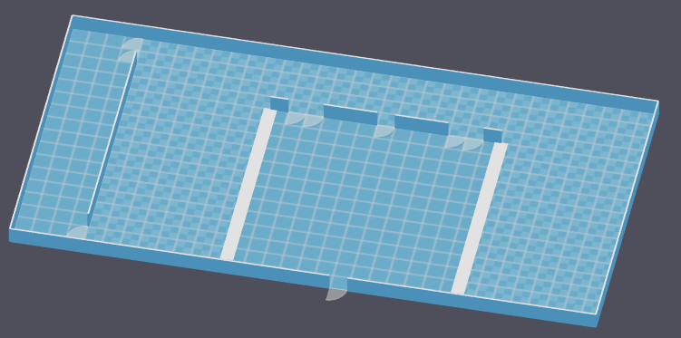
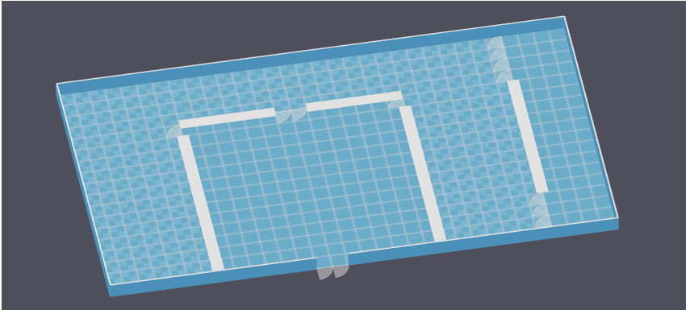
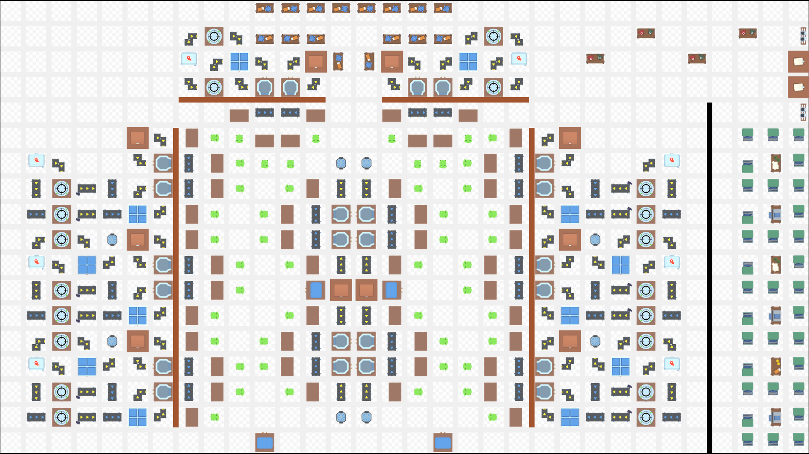
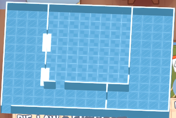
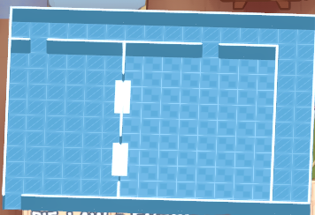

# Layouts
## Custom Layouts with KitchenDesigner
### Layout 0 - Big square dining area with kitchen around

 \
This layout has a total of 33x17 tiles, of which 324 tiles are thought to be for the kitchen. The Dining Area is 13x13 tiles. (For future Taco runs, it would be better if the dining area would be 14x14.)

**String for Kitchen Designer**
```
2LTIwNDU4MDA4MTA6MDoxLDM7MiwyOzMsMTozMywxNzozLjY4LDEuMTM2LDIuMTMsMS40LDIuMTMsMS40LDIuMTMsMS40LDIuMTMsMS40LDIuMTMsMS40LDIuMTMsMS40LDIuMTMsMS40LDIuMTMsMS40LDIuMTMsMS40LDIuMTMsMS40LDIuMTMsMS40LDIuMTMsMS40LDIuMTMsMS4xNDA6MTEsMTIsMTIsMTIsMjsxMSwxMSwxMiwxMSwyOzExLDEwLDEyLDEwLDI7MTEsOSwxMiw5LDI7MTEsOCwxMiw4LDI7MTEsNywxMiw3LDI7MTEsNiwxMiw2LDI7MTEsNSwxMiw1LDI7MTEsNCwxMiw0LDI7MTEsMywxMiwzLDI7MTEsMiwxMiwyLDI7MTEsMSwxMiwxLDI7MjQsMTIsMjUsMTIsMjsyNCwxMSwyNSwxMSwyOzI0LDEwLDI1LDEwLDI7MjQsOSwyNSw5LDI7MjQsOCwyNSw4LDI7MjQsNywyNSw3LDI7MjQsNiwyNSw2LDI7MjQsNSwyNSw1LDI7MjQsNCwyNSw0LDI7MjQsMywyNSwzLDI7MjQsMiwyNSwyLDI7MjQsMSwyNSwxLDI7MTMsMTIsMTMsMTMsMTsxNCwxMiwxNCwxMywxOzIzLDEyLDIzLDEzLDE7MjIsMTIsMjIsMTMsMTsxOCwtMSwxOCwwLDM7MywxNiw0LDE2LDE7MywxNSw0LDE1LDE7MywxLDQsMSwxOzMsMCw0LDAsMTsxOCwxMiwxOCwxMywxOzExLDAsMTIsMCwxOzI0LDAsMjUsMCwxOg==
```

### Layout 1 - Similar to 0
 \
This layout has a total of 32x18 tiles, of which 14x14 are the dining area, the block to the right (4x18) is thought to be the reasearch area.

 \
This layout is our ideal stab at making a taco-only restaurant. Additional Mod used: Automation plus

**String for Kitchen Designer**
```
2LTIwNDU4MDA4MTA6MDoxLDM7MiwyOzMsMTozMiwxODoxLjEyNiwyLjE0LDEuNCwyLjE0LDEuNCwyLjE0LDEuNCwyLjE0LDEuNCwyLjE0LDEuNCwyLjE0LDEuNCwyLjE0LDEuNCwyLjE0LDEuNCwyLjE0LDEuNCwyLjE0LDEuNCwyLjE0LDEuNCwyLjE0LDEuNCwyLjE0LDEuNCwyLjE0LDEuMTMwLDMuNzI6MTMsMTMsMTMsMTQsMTsxNCwxMywxNCwxNCwxOzYsMTMsNywxMywxOzIwLDEzLDIxLDEzLDE7MjAsMCwyMSwwLDE7NiwwLDcsMCwxOzYsMTIsNywxMiwyOzYsMTEsNywxMSwyOzYsMTAsNywxMCwyOzYsOSw3LDksMjs2LDgsNyw4LDI7Niw3LDcsNywyOzYsNiw3LDYsMjs2LDUsNyw1LDI7Niw0LDcsNCwyOzYsMyw3LDMsMjs2LDIsNywyLDI7NiwxLDcsMSwyOzcsMTMsNywxNCwyOzgsMTMsOCwxNCwyOzksMTMsOSwxNCwyOzEwLDEzLDEwLDE0LDI7MTEsMTMsMTEsMTQsMjsxMiwxMywxMiwxNCwyOzE1LDEzLDE1LDE0LDI7MTYsMTMsMTYsMTQsMjsxNywxMywxNywxNCwyOzE4LDEzLDE4LDE0LDI7MTksMTMsMTksMTQsMjsyMCwxMywyMCwxNCwyOzIwLDEyLDIxLDEyLDI7MjAsMTEsMjEsMTEsMjsyMCwxMCwyMSwxMCwyOzIwLDksMjEsOSwyOzIwLDgsMjEsOCwyOzIwLDcsMjEsNywyOzIwLDYsMjEsNiwyOzIwLDUsMjEsNSwyOzIwLDQsMjEsNCwyOzIwLDMsMjEsMywyOzIwLDIsMjEsMiwyOzIwLDEsMjEsMSwyOzI3LDE3LDI4LDE3LDE7MjcsMTYsMjgsMTYsMTsyNywxNSwyOCwxNSwxOzI3LDE0LDI4LDE0LDE7MjcsMywyOCwzLDE7MjcsMiwyOCwyLDE7MjcsMSwyOCwxLDE7MjcsMCwyOCwwLDE7MjcsMTMsMjgsMTMsMjsyNywxMiwyOCwxMiwyOzI3LDExLDI4LDExLDI7MjcsMTAsMjgsMTAsMjsyNyw5LDI4LDksMjsyNyw4LDI4LDgsMjsyNyw3LDI4LDcsMjsyNyw2LDI4LDYsMjsyNyw1LDI4LDUsMjsyNyw0LDI4LDQsMjsxNCwtMSwxNCwwLDM7MTMsLTEsMTMsMCwxOg==
```


## Seeds

---

### 8qvtyq3j
**Shape**  
Big square kitchen, L shaped eating/research\


**Cards**  
In total rather meh cards.\
Franchise options: Supplier error, Preparation time

---

### bcd27

**Shape**
Rectangular serving, rectangular kitchen, L corridor\


**Theme**  
Affordable / Formal

**Cards**  
Splash Zone\
Sedate Atmosphere\
Photographic Memory\
Picky eater\
Individual Dining\
Discounts\
